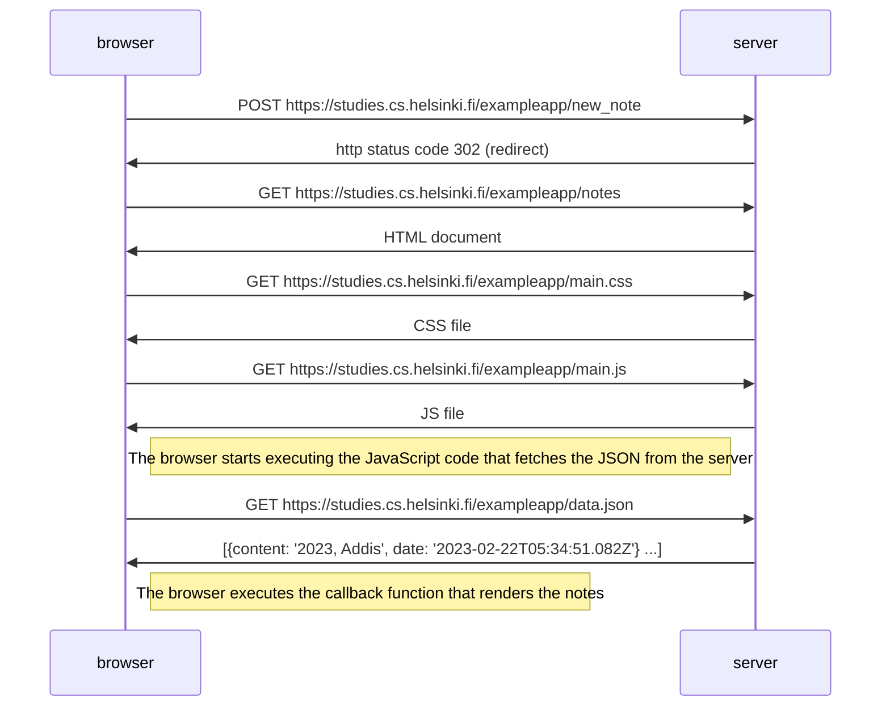

```mermaid
sequenceDiagram
browser->>server: POST https://studies.cs.helsinki.fi/exampleapp/new_note
server->>browser: http status code 302 (redirect)
browser->>server: GET https://studies.cs.helsinki.fi/exampleapp/notes
server->>browser: HTML document
browser->>server: GET https://studies.cs.helsinki.fi/exampleapp/main.css
server->>browser: CSS file
browser->>server: GET https://studies.cs.helsinki.fi/exampleapp/main.js
server->>browser: JS file
Note right of browser: The browser starts executing the JavaScript code that fetches the JSON from the server
browser->>server: GET https://studies.cs.helsinki.fi/exampleapp/data.json
server->>browser: [{content: '2023, Addis', date: '2023-02-22T05:34:51.082Z'} ...]
Note right of browser: The browser executes the callback function that renders the notes 
```
