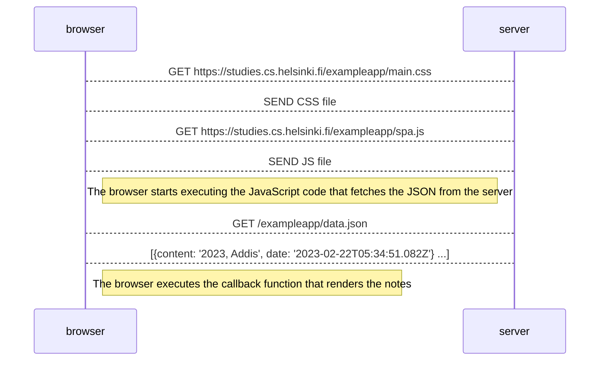

```mermaid
sequenceDiagram
browser-->server: GET https://studies.cs.helsinki.fi/exampleapp/main.css
server-->browser: SEND CSS file
browser-->server: GET https://studies.cs.helsinki.fi/exampleapp/spa.js
server-->browser: SEND JS file
Note right of browser: The browser starts executing the JavaScript code that fetches the JSON from the server
server-->browser: GET /exampleapp/data.json
browser-->server: [{content: '2023, Addis', date: '2023-02-22T05:34:51.082Z'} ...]
Note right of browser: The browser executes the callback function that renders the notes 

```
