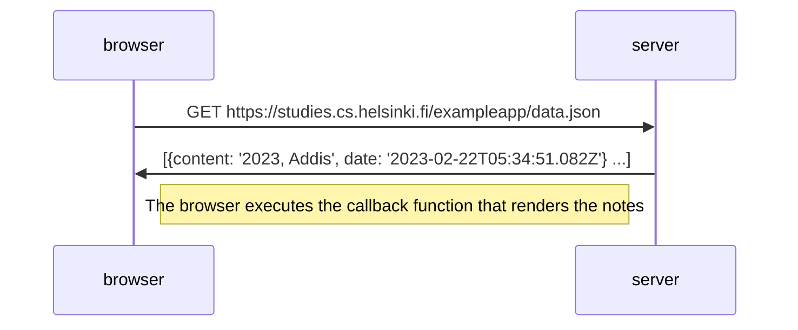

```mermaid
sequenceDiagram


browser->>server: GET https://studies.cs.helsinki.fi/exampleapp/data.json
server->>browser: [{content: '2023, Addis', date: '2023-02-22T05:34:51.082Z'} ...]
Note right of browser: The browser executes the callback function that renders the notes 
```
